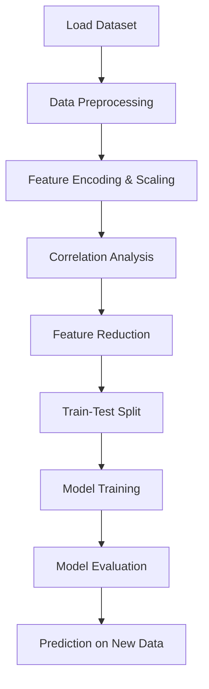

---

# Breast Cancer Prediction using Machine Learning 🧬

  

---

## 📌 Overview

This project predicts whether a breast tumor is **malignant (cancerous)** or **benign (non-cancerous)** using the **Breast Cancer Wisconsin (Diagnostic) Dataset**. It demonstrates the **end-to-end pipeline** of data preprocessing, feature selection, model building, and evaluation.

---

## 🚀 Key Highlights

- **Data Cleaning & Preprocessing**

  - Removal of irrelevant columns
  - Encoding target variable (`M` → 1, `B` → 0)
  - Feature scaling for uniformity

- **Feature Selection**

  - Correlation analysis to identify multicollinearity
  - Dropping features with correlation > 0.92

- **Model Development**

  - Logistic Regression, Random Forest, SVM, KNN
  - Train-Test split (70-30) and scaling

- **Evaluation**

  - Accuracy, Precision, Recall, F1-score
  - Confusion Matrix visualization

---

## 🧠 Workflow



---

## 📊 Visualizations

### Correlation Heatmap


### Confusion Matrix


---

## 📂 Dataset

- **Source:** [Breast Cancer Wisconsin Dataset](https://archive.ics.uci.edu/ml/datasets/Breast+Cancer+Wisconsin+%28Diagnostic%29)
- **Features:** 30 (after correlation reduction fewer)
- **Target:** `diagnosis` (Malignant = 1, Benign = 0)

---

## 🏆 Results

- Achieved **95–98% accuracy**
- Logistic Regression and Random Forest performed best
- Robust predictions with minimal false positives/negatives

---

## ⚙️ Installation

```bash
git clone https://github.com/RadyNoor/Breast-Cancer-Prediction.git
cd Breast-Cancer-Prediction

```

---

## 🔮 Future Scope

- Hyperparameter tuning for better accuracy
- Deployment as a Flask/Streamlit web app
- Integrate SHAP/LIME for explainability

---

## 👨‍💻 Author

**RADY NOOR**
_Computer Science Graduate | AI & ML Enthusiast_

---
